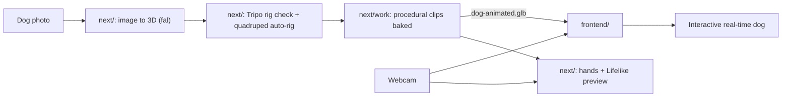

# Implementation (overview)

System-level design and roadmap. Each folder has its own detailed doc; this file covers how the pieces fit together.

## System

| Part | Status | Where |
| --- | --- | --- |
| Hand tracking, virtual hands, depth reach, gestures (pinch/fist/open/point) | Working | [frontend/IMPLEMENTATION.md](frontend/IMPLEMENTATION.md) |
| 3D world (fixed camera, flat ground), ball physics, grab/throw/catch, petting | Working, with a placeholder dog | [frontend/IMPLEMENTATION.md](frontend/IMPLEMENTATION.md) |
| Image → 3D model | Working (fal, needs API key) | [next/README.md](next/README.md) |
| Rig check + quadruped auto-rig | Working (Tripo, needs API key) | [next/README.md](next/README.md) |
| Dog and Pikachu animation libraries | Baked into `next/public/dog-animated.glb` and `next/public/Pikachu.glb` | [next/README.md](next/README.md#extending-the-animation-library) |
| Human rigs and interaction clips (LeBron James, Keanu Reeves) | Fresh 23-joint rigs and 14 clips each | [next/README.md](next/README.md#human-animation-library) |
| Model viewer and Lifelike interactions | First-person hands; waves, approach walking, touch-based affection/high fives, and idle behavior for the selected character | [next/README.md](next/README.md#lifelike-view) |
| Fetch in the model viewer | Room mesh ball physics, pinch throws, cancellable retrieval, human hand and animal mouth handoffs in First person/Lifelike | [next/README.md](next/README.md#fetch) |
| Environments | Default floor or study-lounge capture, with optional characters, grounded collision, and independent exploration in `next/` | [next/README.md](next/README.md#environments) |
| Real dog loaded in the frontend | Not started | — |
| Dog behavior (fetch, petting reactions, tricks) | Not started | [frontend/IMPLEMENTATION.md](frontend/IMPLEMENTATION.md) |

## The two apps

- **`next/`** makes and inspects the dog asset and now previews the frontend’s webcam hands in first person. It calls paid APIs server-side, and its outputs live only in browser memory until downloaded. A good result is saved into `next/public/` by hand.
- **`frontend/`** is the real-time experience that gets demoed. It only needs static files (the GLB), not the `next/` server.

## Handoff: model → frontend

### What exists now

`next/public/dog-animated.glb`:

- Format: glTF binary, a single skinned mesh with a **21-joint** Tripo quadruped rig. The original model, textures and skin weights are preserved.
- Looping clips: `Idle`, `Tail wag`, `Walk`, `Trot`, `Scratch`, `Happy`, `Sniff`. One-shot reactions: `Headpat`, `Curious`, `Play bow`, `Shake`, `Offer paw`. Locomotion stays **in place**: the frontend must move the root itself while playing it. The new reaction clips include loop/duration metadata; see [next/README.md](next/README.md#extending-the-animation-library) for generation and playback.
- Bone names are Tripo's and not anatomical. For example, `Spine_2` is the front-right shoulder and `bone_12` is the hind-left hip (see the leg table in `next/work/animate-dog.mjs`). The frontend should map the bones it needs by index or name once and keep that map in one place.
- Scale and placement aren't normalized to meters. The `next/` viewer recenters it and scales its largest dimension to 1.2 units for first-person preview, without changing the file. The frontend needs to do the same: scale to a real dog size (~0.9–1.0 m nose to tail, ~0.5 m at the shoulder), put the feet on Y = 0, and work out which way it faces.

### What the frontend still needs (to agree with the `next/` side)

- Port the runtime fetch poses/sockets in `next/lib/fetch/character-pose.ts` and fetch state/navigation from `next/lib/fetch/controller.ts`, or bake equivalent clips for the standalone frontend. The existing `Headpat`, `Happy`, and `Tail wag` clips can handle affection reactions.
- A known facing direction and ground contact, or one documented correction transform.
- A size budget for real-time use: ideally under ~50k triangles, textures ≤ 2048². Check the current GLB against this before shipping.
- File location for the frontend: copy (or symlink) the GLB to `frontend/public/models/dog.glb`, served as `/models/dog.glb`. Keep `next/public/dog-animated.glb` as the source of truth.

If the pipeline later outputs a Gaussian splat or SDF instead of a skinned mesh, this handoff changes: splats need a dedicated loader and skeleton binding to animate.

### Human characters

`next/public/lebron-animated.glb` and `next/public/keanu-animated.glb` are rebuilt from the unrigged `lebron.glb` and `keanu.glb` sources. Both have anatomical 23-joint skeletons and **Idle, Wave, Walk, Jog, Headpat, Petting, Curious, Nod, High five, Beckon, Celebrate, Shrug, Startled, Drowsy** clips. The arm-only greetings preserve body/leg vertices; locomotion stays in place. Both are 1 unit tall, centered at Y=0, facing +X (left is -Z); scale to the desired height and raise by half that height to place the soles on the ground. The `next/` first-person preview uses a 1.6-unit camera eye height, a 1.72-unit Keanu (eyes near camera height), and a 2.06-unit LeBron (eyes above camera height), starting in front of the humans with a level gaze.

`next/lib/character-animation-player.ts` provides interruption-safe crossfades and replay, honoring each GLB clip's loop metadata. A future hand controller can play greetings/affection clips and move the parent group while Walk/Jog plays. These assets are available in the `next/` viewer; hand tracking and human behavior integration in `frontend/` remain separate. See the [human library documentation](next/README.md#human-animation-library) for bone names, generation, and deformation checks.

## Integration points already in the frontend

The frontend emits gameplay events the dog can react to: `grab`, `release`, `throw`, `landed`, `returned`, `pet` (see the events table in [frontend/IMPLEMENTATION.md](frontend/IMPLEMENTATION.md)). The dog placeholder lives in `frontend/src/world/world.ts` and is what the GLB replaces. Both apps use `three@0.186`, so loaders and animation code can be shared or copied between them. The first migration copies `frontend/src/hands/` into `next/lib/hands/`: both detected hands render over the first-person scene with mirrored viewer-relative coordinates, and a top-center readout shows their debounced poses. The separate `next/` Lifelike view connects temporal gestures and animated-bone contact to the existing clips, including approach movement, short idle strolls, character-specific idle clips, and post-pet happy/tail-wag reactions. Its gesture layer tolerates tracking cadence and relaxed fingers; petting uses palm/fingertip contact with bounded depth tolerance and a 0.8-unit resting reach. Procedural idle motion is applied after the mixer and removed before its next update, using each rig's facing axis and preserving planted feet. These preview adjustments do not alter the GLB files or the frontend's depth mapping. Ball physics and the frontend’s gameplay events are still frontend-only. See [Lifelike view](next/README.md#lifelike-view) and [first-person hands](next/README.md#first-person-hands) for behavior and synchronization details.

## Roadmap

1. Load `dog-animated.glb` into the frontend scene: normalize scale/facing, play `Idle`, use `Tail wag` while petting.
2. Dog behavior state machine driven by frontend events, using `Walk` with root motion; add procedural head look-at toward the hand/ball.
3. Port the completed `next/` fetch loop and runtime mouth attachment/pickup pose into the standalone frontend.
4. Hands rendered inside the 3D scene, so the dog occludes them correctly.
5. Environment upgrade (Gaussian splat or scan), plus performance hardening and polish.

Frontend-specific tasks are expanded in [frontend/IMPLEMENTATION.md](frontend/IMPLEMENTATION.md#what-needs-to-be-built).
