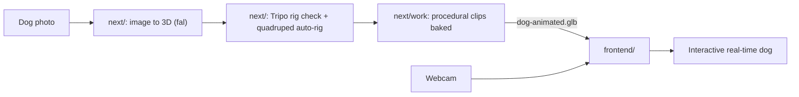

# Implementation (overview)

System-level design and roadmap. Each folder has its own detailed doc; this file covers how the pieces fit together.

## System

| Part | Status | Where |
| --- | --- | --- |
| Hand tracking, virtual hands, depth reach, gestures (pinch/fist/open/point) | Working | [frontend/IMPLEMENTATION.md](frontend/IMPLEMENTATION.md) |
| 3D world (fixed camera, flat ground), ball physics, grab/throw/catch, petting | Working, with a placeholder dog | [frontend/IMPLEMENTATION.md](frontend/IMPLEMENTATION.md) |
| Image → 3D model | Working (fal, needs API key) | [next/README.md](next/README.md) |
| Rig check + quadruped auto-rig | Working (Tripo, needs API key) | [next/README.md](next/README.md) |
| Animation clips (Idle, Tail wag, Walk) | Baked into `next/public/dog-animated.glb` | `next/work/animate-dog.mjs` |
| Model viewer (skeleton, joint posing, clip playback, first person) | Working | `next/components/viewer.tsx` |
| Real dog loaded in the frontend | Not started | — |
| Dog behavior (fetch, petting reactions, tricks) | Not started | [frontend/IMPLEMENTATION.md](frontend/IMPLEMENTATION.md) |

## The two apps

- **`next/`** is an offline authoring tool: it makes and inspects the dog asset. It calls paid APIs server-side, and its outputs live only in browser memory until downloaded. A good result is saved into `next/public/` by hand.
- **`frontend/`** is the real-time experience that gets demoed. It only needs static files (the GLB), not the `next/` server.

## Handoff: model → frontend

### What exists now

`next/public/dog-animated.glb`:

- Format: glTF binary, a single skinned mesh with a **21-joint** Tripo quadruped rig. The original model, textures and skin weights are preserved.
- Clips: `Idle` (4 s loop), `Tail wag` (2 s loop), `Walk` (1.6 s loop, **in place**: the frontend must move the root itself while playing it).
- Bone names are Tripo's and not anatomical. For example, `Spine_2` is the front-right shoulder and `bone_12` is the hind-left hip (see the leg table in `next/work/animate-dog.mjs`). The frontend should map the bones it needs by index or name once and keep that map in one place.
- Scale and placement aren't normalized to meters. The `next/` viewer recenters it and scales its largest dimension to 1.2 units for first-person preview, without changing the file. The frontend needs to do the same: scale to a real dog size (~0.9–1.0 m nose to tail, ~0.5 m at the shoulder), put the feet on Y = 0, and work out which way it faces.

### What the frontend still needs (to agree with the `next/` side)

- Clips for fetch: `run`, `pickup` (or a mouth socket bone/empty for attaching the ball), `drop`, `sit`, and a happy/excited reaction for petting.
- A known facing direction and ground contact, or one documented correction transform.
- A size budget for real-time use: ideally under ~50k triangles, textures ≤ 2048². Check the current GLB against this before shipping.
- File location for the frontend: copy (or symlink) the GLB to `frontend/public/models/dog.glb`, served as `/models/dog.glb`. Keep `next/public/dog-animated.glb` as the source of truth.

If the pipeline later outputs a Gaussian splat or SDF instead of a skinned mesh, this handoff changes: splats need a dedicated loader and skeleton binding to animate.

## Integration points already in the frontend

The frontend emits gameplay events the dog can react to: `grab`, `release`, `throw`, `landed`, `returned`, `pet` (see the events table in [frontend/IMPLEMENTATION.md](frontend/IMPLEMENTATION.md)). The dog placeholder lives in `frontend/src/world/world.ts` and is what the GLB replaces. Both apps use `three@0.186`, so loaders and animation code can be shared or copied between them.

## Roadmap

1. Load `dog-animated.glb` into the frontend scene: normalize scale/facing, play `Idle`, use `Tail wag` while petting.
2. Dog behavior state machine driven by frontend events, using `Walk` with root motion; add procedural head look-at toward the hand/ball.
3. Fetch loop: more clips or a mouth attachment point from the `next/` side.
4. Hands rendered inside the 3D scene, so the dog occludes them correctly.
5. Environment upgrade (Gaussian splat or scan), plus performance hardening and polish.

Frontend-specific tasks are expanded in [frontend/IMPLEMENTATION.md](frontend/IMPLEMENTATION.md#what-needs-to-be-built).
