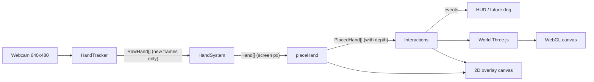

# Frontend implementation

How the frontend works, why it's built this way, and what's left to build. For a quick map see [AGENTS.md](AGENTS.md); for usage see [README.md](README.md); for how it connects to the model/rigging pipeline see [../IMPLEMENTATION.md](../IMPLEMENTATION.md).

## Goal

[CHALLENGE_2.md](../CHALLENGE_2.md): bring a static dog photo to life as a real-time interactive pet. It's judged on **computational efficiency**, **interactivity**, and **aesthetics & animation**.

The user's own hands, tracked by webcam, are the input device. You reach into a 3D scene to pet the dog and throw things for it. What exists today is the hand-interaction layer plus a placeholder world and dog.

## Architecture

Two stacked full-screen canvases:

- `#world`: WebGL, rendered by Three.js (ground, sky, stand, dog placeholder, ball, trail, shadows).
- `#overlay`: 2D canvas on top (hands, their ground shadows, hearts, debug skeleton).

Hands are drawn in 2D on top of everything. That's correct while hands are the nearest object to the camera, and it's cheap. It breaks when a hand reaches *behind* scene geometry (see Known limitations).

`main.ts` runs one `requestAnimationFrame` loop. Inference only runs when the video has a new frame (~30 Hz), while rendering and physics run at display rate. The loop starts before the camera so the scene renders even if permission is denied.

## Hand tracking (`src/hands/`)

### `tracker.ts`

- MediaPipe `HandLandmarker`, `VIDEO` mode, `numHands: 2`, confidence thresholds 0.5, float16 model. It tries the GPU delegate first and falls back to CPU (shown in the HUD).
- Returns `null` when `video.currentTime` hasn't advanced, so we never run inference twice on one frame.
- Returns both **image landmarks** (normalized, used for drawing and position) and **world landmarks** (metric, hand-centered, used for pose and scale).
- Swaps Left/Right handedness, because MediaPipe assumes a mirrored input and ours isn't.

### `handSystem.ts`

Turns per-frame detections into stable tracked hands ("slots").

- **Identity:** detections are greedily matched to existing slots by nearest wrist, within 0.25 normalized units. Slots are marked `stale` after 90 ms without a detection and dropped after 260 ms, with `presence` fading the drawing out.
- **Mirroring and mapping:** x is mirrored once here. `toScreen` maps video coords to the window "cover"-style (uniform scale, centered crop), so hand proportions are preserved.
- **Smoothing:** a One Euro filter on each landmark's x and y (min cutoff 1.6 Hz, beta 6). This gives heavy smoothing when the hand is still and low lag when it moves fast.
- **Pose debounce:** a new pose must be seen for 2 consecutive detections before it's adopted.
- **Velocity and growth:** computed over a 110 ms window from **unsmoothed** palm positions and log-scale, so filter lag doesn't damp throws. `velocity` is px/s. `growth` is d(ln scale)/dt, which is positive when the hand moves toward the webcam.
- **Robust scale (`videoPxPerMeter`):** fits the 8 rigid palm bones in the camera-facing XY plane between image and world landmarks. Both measurements foreshorten together, keeping reach and motion normalization robust to hand tilt. Per-frame log-scale changes are capped before a low-beta One Euro filter rejects landmark outliers without making normal reaching sluggish.
- **Depth calibration:** the median log-scale of the first 20 detections is the rest scale, shared by both hands. `C` (`recalibrate()`) re-collects it. With a pinhole camera model: `distance = REST_CAMERA_DISTANCE × scale_rest / scale_now` and `reach = REST_CAMERA_DISTANCE − distance`, clamped to −0.2…0.45 m. Scale gets its own One Euro filter (on the log, 1.4 Hz / 0.25 beta). `REST_CAMERA_DISTANCE` (0.5 m) is an assumption, but an error in it only scales reach linearly, which the gain absorbs.

### `pose.ts`

Classifies from **world landmarks**, so it's invariant to distance and in-plane rotation.

- Finger bend = sum of joint angles at MCP, PIP and DIP. Extended means < 70°; curled means > 130°.
- Pinch = thumb-tip to index-tip distance ÷ palm length, with hysteresis: enter < 0.32, exit > 0.5.
- Priority: **fist** (index curled and at least 2 other fingers curled) beats **pinch**, because in a fist the thumb rests near the index tip. Then **open** (at least 4 fingers extended), **point** (index extended, at least 2 others curled), and otherwise **relaxed**.
- `closed` = pinch or fist. That's what grabbing uses.

### `render.ts`

White hands with black outlines and black sleeves, shown from behind with palms facing into the scene. The real palm faces the webcam; the virtual hand keeps the same thumb position, screen motion, and observed size.

- Draw order: a black sleeve that widens toward the elbow with a subtle cuff, followed by fingers and thumb behind the hand body. When a fingertip folds back into the hand, its distal segments are hidden and the proximal segment forms the visible knuckle. Extended fingers and the thumb retain their tracked positions. One outline pass followed by a solid fill merges overlapping pieces into a cohesive silhouette with no interior contours or crease lines.
- Pinch shows an amber ring at the pinch point. Petting shows a green ring around the palm. A pose label sits under the wrist.
- The debug skeleton (`D`) shows the landmarks, the connections between them, and a palm velocity vector.

## World and interaction (`src/world/`)

### `world.ts`

- Fixed `PerspectiveCamera`: 55° vertical FOV, eye at `(0, 1.4, 0)`, looking at `(0, 0.95, −3)`.
- Ground: a 200 m plane with a canvas-generated grass texture showing a 1 m grid, which gives a scale and depth cue. Fog runs from 15 to 90 m, and a vertex-colored sky dome blends into the fog color at the horizon.
- Lighting: a hemisphere light plus a directional sun casting 2048² PCF shadows over a ±14 m box. The ball's shadow is the key cue for judging its height.
- Props: a ball stand at `(0.32, 0, −0.85)`, 0.95 m tall, within arm's reach. A dog placeholder (capsule body, sphere head, ground ring) at `(−0.15, 0, −1.3)`. `dogBounds` covers only the body and head.
- Ball: radius 4.5 cm, with a 40-point trail line while it's flying.
- Helpers: `project` (world → screen px + distance), `rayPoint` (screen px + distance → world), `screenRadius`, `focalPx`, `dogScreenRect`, `dogDistance`.
- Pixel ratio is capped at 1.5 for performance.

### `handDepth.ts`

Turns a `Hand` into a `PlacedHand`:

- `distance = clamp(0.45 + reach × 4, 0.25, 2.2)` m from the eye. A comfortable ~25 cm push maps to about 1 m of virtual reach.
- Points, pinch point, and drawing size pass through directly from the mirrored, smoothed screen landmarks. The drawing grows as the real hand moves closer to the webcam; virtual depth only controls interactions and ground shadows.
- `palmWorld` is the 3D palm position. `handLengthPx` is the *observed* palm length, used to normalize speeds.
- `drawHandShadows`: an ellipse on the ground under `palmWorld`, squashed by viewing angle and faded with height. It's only visible once the ground under the hand is on screen, i.e. when reaching out.

### `interactions.ts`

**Ball state machine:** `docked` (on the stand), then `held`, then `flying` (physics), then back to `docked`.

- **Grab** happens on a hand's open → closed transition when two things are true. First, on screen, the grip point is within ball radius + 0.6 × hand size. Second, the hand's depth is within 0.3 m of the ball's. The grip point is the pinch point for a pinch and the palm for a fist. A flying ball can be caught mid-air.
- **Held:** the ball follows the 3D point just beyond the grip, using exponential smoothing at a rate of 30/s.
- **Release** happens on closed → open. A **stale hand counts as open**, so a throw fast enough to lose tracking still releases.
- **Throw vs. drop:** a release counts as a throw if the hand speed is ≥ 3.5 hand-lengths/s or growth is ≥ 1.2/s. Otherwise it's a gentle drop.
  - Throw velocity in m/s:
    - x = 0.213 × lateral speed
    - y = 0.267 × upward speed
    - z = −(0.3 × total speed + 1.467 × growth)
  - Total speed is capped at 10.67 m/s.
- **Physics:** 240 Hz substeps, gravity 9.81, small air drag, ground bounce 0.55 (bounces slower than 0.6 m/s stop), rolling damping on the ground. The ball can also land back on the stand top. Spin is derived from rolling velocity.
- **Return:** the ball docks again (with a pop-in scale animation) after 1.2 s at rest, after 10 s of flight, or when it's more than 45 m out.
- **Pet:** an open palm inside the ellipse inscribed in the dog's screen rect, with depth within 0.45 m of the dog's and speed ≥ 2 hand-lengths/s. `petLevel` (0 to 1) rises with stroke speed and decays at 0.25/s. Hearts spawn every 200 ms while petting.
- **Visual feedback:** the ball's emissive glow shows when it's grabbable (grey) or held (amber).

**Events** (`interactions.on(listener)`). These are the integration point for the dog:

| Event | Payload | Intended use |
| --- | --- | --- |
| `grab` | `handId`, `target: "ball" \| "none"` | Dog watches the ball / looks at hand |
| `release` | `handId`, `position` | Ball dropped nearby |
| `throw` | `handId`, `position`, `velocity` (m/s) | Dog gets ready, tracks the ball |
| `landed` | `position` | Dog runs to fetch |
| `returned` | — | Ball back on the stand (replace with fetch) |
| `pet` | `handId`, `strength` 0–1, `screen` | Happy reaction, tail wag, lean into hand |

## Performance notes

- Inference: one `detectForVideo` per new camera frame, GPU delegate, 640×480 input. It runs synchronously on the main thread; the HUD shows its cost in ms.
- Rendering: one shadow-casting light, a handful of meshes, pixel ratio ≤ 1.5. The 2D overlay is about 40 stroke calls per hand.
- The HUD's DOM text updates every 500 ms. The pet bar uses a CSS `transform` to avoid layout.
- The hot paths reuse `THREE.Vector3` instances. `placeHand` and `dogScreenRect` still allocate small objects each frame; that's fine for now.

## Known limitations

- **Occlusion:** hands are drawn on top of the 3D scene, so a hand reaching past the dog still appears in front of it.
- **Depth is relative:** it depends on calibration. Moving your body after calibrating shifts the rest point, so press `C` again.
- **Fast motion:** MediaPipe can lose tracking on very fast throws. Release-on-stale handles the throw, but the velocity estimate is from the last tracked frame.
- **Single fixed camera:** there's no head tracking or parallax.
- **Main-thread inference:** a slow device will see frame drops when inference runs.
- **Throw tuning:** the mapping from hand motion to throw velocity is heuristic and still needs tuning with more users.

## What needs to be built

Rough priority order for the hackathon:

1. **Load the real dog.** Replace the placeholder in `world.ts` with the teammate's rigged model via `GLTFLoader`, following the handoff contract in [../IMPLEMENTATION.md](../IMPLEMENTATION.md). Drive clips with an `AnimationMixer` and update `dogBounds` / the pet target from the model (head/back bones instead of the whole bounding box).
2. **Dog behavior:** a small state machine (idle, watch, chase, pick up, return, drop, be petted) driven by the interaction events. Add procedural layers on top of the clips: head look-at toward the hand or ball, tail wag scaled by `petLevel`.
3. **Fetch loop:** on `landed`, the dog runs to the ball, picks it up, brings it back near the user, and drops it within reach. This replaces the automatic `returned` behavior.
4. **Hands in 3D:** render hands as meshes (or impostors) in the Three.js scene so they're depth-tested against the dog. This fixes occlusion and also enables contact shadows and lighting.
5. **More interactions and tricks:** treats, a tug toy, pointing to send the dog somewhere (the `point` pose already exists), and waving or hand signals to trigger tricks.
6. **Environment:** replace the flat field with a Gaussian splat or 3D scan of a real place, keeping a collision ground for the physics.
7. **Performance hardening:** move inference to a Web Worker (feed it `ImageBitmap`s from `createImageBitmap(video)`; GPU delegate in workers needs testing), and add an adaptive quality toggle (shadows, pixel ratio).
8. **Polish:** onboarding (calibration prompt, gesture hints), sound, and a tracking-lost indicator.
